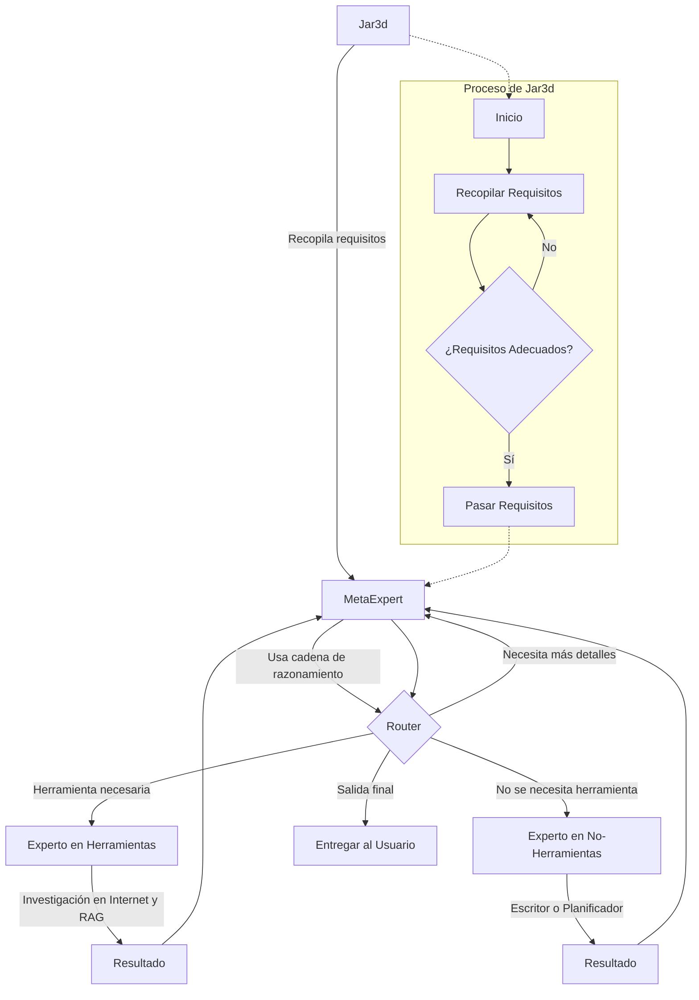

# Introducción a Jar3d

## Declaración del Problema
El objetivo fue desarrollar un agente de IA capaz de aprovechar al máximo tanto modelos propietarios como de código abierto para tareas de investigación intensiva.

## ¿Qué es Jar3d?
Jar3d es un agente de investigación versátil que combina técnicas de [cadena de razonamiento](https://github.com/ProfSynapse/Synapse_CoR), Meta-Prompting y RAG Agente.

- Cuenta con integraciones con proveedores populares y modelos de código abierto, permitiendo una operación 100% local, siempre que se disponga de recursos de hardware suficientes.
- La investigación se realiza a través de la API SERPER, brindando al agente acceso a la búsqueda en Google y compras, con planes de ampliar esto para incluir otros servicios.

### Casos de Uso y Aplicaciones
- Tareas de investigación prolongadas, redacción de revisiones de literatura, boletines informativos, búsqueda de productos, etc.
- Potencial adaptación para su uso con documentos internos de la empresa, sin necesidad de acceso a Internet.
- Puede funcionar como asistente de investigación o una versión local de servicios como Perplexity.

Para instrucciones de configuración, consulte la guía [Configurar Jar3d](https://github.com/brainqub3/meta_expert).

## Ingeniería de Prompts
Jar3d utiliza dos prompts potentes escritos completamente en Markdown:
1. [Meta-Prompt de Jar3d](https://github.com/brainqub3/meta_expert/blob/main/prompt_engineering/jar3d_meta_prompt.md)
2. [Prompt de Requisitos de Jar3d](https://github.com/brainqub3/meta_expert/blob/main/prompt_engineering/jar3d_requirements_prompt.md)

Ambos prompts incorporan adaptaciones de la técnica de Cadena de Razonamiento.

## Arquitectura de Jar3d
La arquitectura de Jar3d incorpora aspectos de Meta-Prompting, RAG Agente y una adaptación de la [Cadena de Razonamiento](https://github.com/ProfSynapse/Synapse_CoR).

## Mecanismo de Recuperación de Jar3d para Investigación en Internet

Este sistema emplea un mecanismo de recuperación sofisticado para realizar investigaciones en Internet. El proceso involucra varios pasos, utilizando diversas herramientas y técnicas para asegurar resultados completos y relevantes.

### 1. Descubrimiento de Páginas Web

- Utiliza la herramienta SERPER para encontrar páginas web relevantes.
- Emplea un algoritmo de búsqueda ejecutado por LLM, expresado en lenguaje natural.
- Cada iteración del algoritmo genera una consulta de búsqueda para SERPER.
- SERPER devuelve una página de resultados de motor de búsqueda (SERP).
- Otra llamada de LLM selecciona la URL más apropiada de la SERP.
- Este proceso se repite un número predeterminado de veces para compilar una lista de URLs para investigación profunda.

### 2. Extracción y Fragmentación de Contenido

- Utiliza [LLM Sherpa](https://github.com/nlmatics/llmsherpa) como ingeridor de documentos.
- Fragmenta inteligentemente el contenido de cada URL en la lista compilada.
- Resulta en un corpus de texto fragmentado a través de todas las URLs acumuladas.

### 3. Embedding de Texto

- Embeds el texto fragmentado utilizando un modelo alojado localmente de [FastEmbed](https://qdrant.github.io/fastembed/#installation).
- Indexa los embeddings en una tienda de vectores [FAISS](https://api.python.langchain.com/en/latest/vectorstores/langchain_community.vectorstores.faiss.FAISS.html) en memoria.

### 4. Búsqueda de Similitud

- Realiza la recuperación utilizando una búsqueda de similitud sobre la tienda de vectores FAISS.
- Utiliza la similitud coseno entre los embeddings indexados y el meta-prompt (escrito por el meta-agente).
- Recupera la información más relevante basada en esta medida de similitud.

### 5. Re-ranking

- Aprovecha [FlashRank](https://github.com/PrithivirajDamodaran/FlashRank) como un servicio de re-ranking alojado localmente.
- FlashRank utiliza cross-encoders para una evaluación más precisa de la relevancia del documento en relación con la consulta.

### 6. Selección Final

- Selecciona un percentil designado de los documentos con mayor puntuación de los resultados reordenados.
- Pasa este conjunto final de documentos recuperados al meta-agente para un procesamiento o análisis adicional.