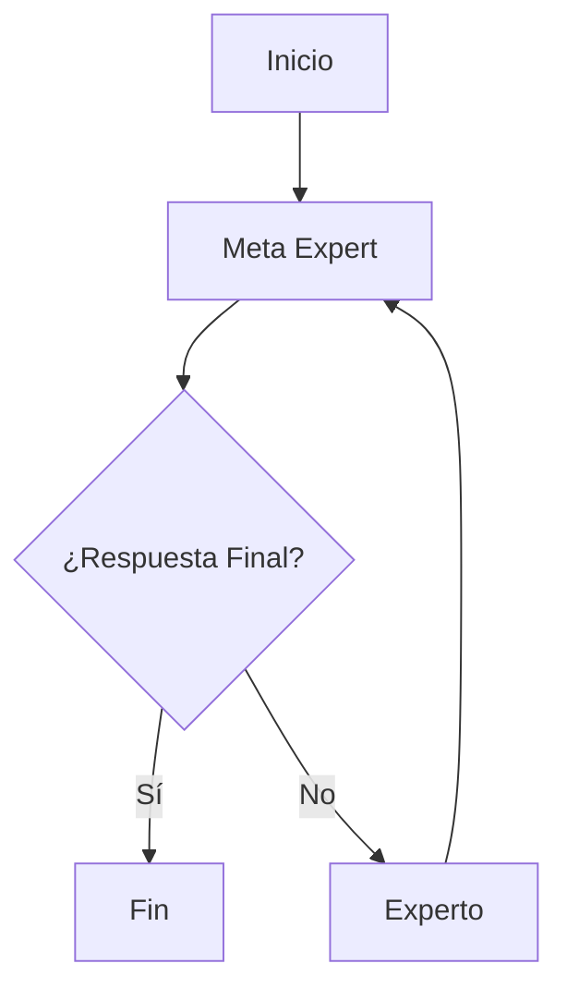

Estas notas están derivadas de [Fuente](https://arxiv.org/abs/2401.12954)

## ¿Qué es Meta-Prompting?  
Una técnica de estructura que convierte un solo LLM en un orquestador que gestiona múltiples LLM especializados. No es necesario generar un prompt para cada especialista porque le das un prompt al orquestador para que cree los prompts.  

## Aspectos Clave del Meta-Prompting  
* Las decisiones sobre qué prompts utilizar y qué códigos ejecutar quedan totalmente a cargo del LLM.  
* Ha demostrado superar a otros métodos de estructura agnósticos a tareas.  
* El Meta-Prompting tiene cuatro partes:  
  1. Descomponer tareas complejas en partes más pequeñas.  
  2. Asignar esas partes a modelos expertos especializados.  
  3. Supervisar la comunicación entre estos modelos expertos.  
  4. Aplicar su propio pensamiento crítico, razonamiento y habilidades de verificación.  

* El Meta-Prompting es agnóstico a las tareas.  
* Mejora con un intérprete.  
  1. El Meta-Prompting ha demostrado ser poderoso cuando se combina con un intérprete. Más sobre intérpretes de código aquí: [[OS Code Interpreter]]  

## Lo Que Dice la Investigación  

### Fortalezas  
A través de rigurosos experimentos con GPT-4, el Meta-Prompting, mejorado por la funcionalidad del intérprete de Python, ha demostrado superar los métodos convencionales de estructura. En promedio, supera el prompting estándar en un 17.1%, el prompting experto (dinámico) en un 17.3%, y el prompting de multipersona en un 15.2% en tareas como el Juego de 24, Jaque Mate en Uno, y Puzzles de Programación en Python.  

### Debilidades  
Aquí están las principales debilidades del marco de Meta-Prompting, según el texto proporcionado:

* Ineficiencia en costos: Múltiples llamadas a modelos, especialmente con GPT-4, conducen a altos costos operativos.  
* Problemas de escalabilidad: Requiere modelos a gran escala con amplias ventanas de contexto, lo que limita su uso con modelos más pequeños.  
* Operación lineal: El procesamiento secuencial de los pasos limita las capacidades de procesamiento paralelo, afectando la velocidad y eficiencia.  
* Restricciones de dominio: La implementación actual está limitada a sistemas de dominio cerrado, aunque existe potencial de expansión.  
* Desafíos de transferencia de información: A veces, el Meta Model no comunica eficazmente la información necesaria a los modelos expertos.  
* Patrones de respuesta: Tendencia a respuestas apologéticas en tareas de bajo rendimiento, probablemente debido a un entrenamiento basado en datos de seguimiento de instrucciones.  
* Paralelismo limitado: El diseño actual no permite consultas simultáneas de expertos ni el uso de parámetros variados dentro de un solo experto.  
* Gestión de contexto: Falta de resúmenes eficientes del historial o refinamiento entre los pasos.  
* Dependencia de modelos: Fuerte dependencia de modelos avanzados, lo que limita su efectividad con modelos de lenguaje más pequeños.  

Estos puntos resumen las principales limitaciones y desafíos que enfrenta el marco de Meta-Prompting, según lo descrito en el texto.  

[Fuente](https://arxiv.org/abs/2401.12954)

## Meta-Prompting con Búsqueda en la Web  

Usando Meta-Prompting para construir un agente de búsqueda web. #agentes #metaprompting

**Librerías y Frameworks**  
* Utiliza [LangGraph](https://langchain-ai.github.io/langgraph/) para la orquestación de agentes.

**Esquema del Agente:**  
Se requieren solo tres agentes.  
- Meta Expert: El agente Meta Expert.  
- No Tool Expert: Los agentes que reciben instrucciones que no involucran herramientas.  
- Tool Expert: El agente que recibe instrucciones basadas en herramientas, como (buscar en internet).  

**El Prompt**  
El Meta-Prompt está escrito en Markdown. Esto lo hace mucho más fácil de leer y permite una forma estandarizada de escribir prompts que la mayoría de los LLMs deberían entender. Explora el [[Meta-Prompt]]  
