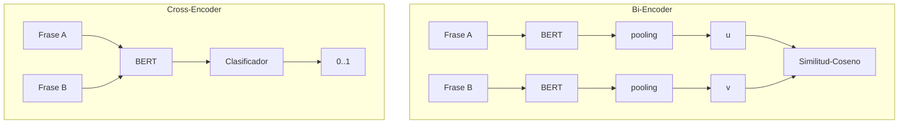

## Componentes Principales del RAG Agente

El RAG Agente tiene **dos** componentes principales:  
1. Planificación y ejecución dinámica  
   1. La estrategia agente que utilizamos para planificar y ejecutar una consulta del usuario.  
2. Pipeline de recuperación  
   1. Estrategia de análisis y fragmentación de documentos: Cómo extraemos texto de varios tipos de documentos y los dividimos en subdocumentos más pequeños.  
   2. Modelos de embeddings: Los modelos que usamos para transformar los subdocumentos en representaciones vectoriales numéricas que podemos almacenar en bases de datos de vectores y recuperar más tarde.  
   3. Estrategia de recuperación de documentos: La estrategia que utilizamos para recuperar los subdocumentos y responder consultas.

### Planificación y Ejecución Dinámica  
- [LangGraph](https://langchain-ai.github.io/langgraph/) utiliza un grafo computacional para ejecutar flujos de trabajo basados en agentes.

### Pipeline de Recuperación  
El pipeline de recuperación consistirá en un analizador de documentos, un modelo de embeddings y una métrica de similitud (para la que recuperamos nuestros embeddings).

#### Estrategia de Análisis y Fragmentación de Documentos  
El análisis de documentos debe tener lo siguiente:
- Flexibilidad: Maneja una gama de tipos de documentos como pdf, html, txt, etc.
- Consciencia Estructural: Debe ser capaz de analizar documentos de manera que se preserve la estructura del documento, incluyendo elementos como tablas.

#### Estrategia de Embeddings y Recuperación  

[Fuente](https://www.sbert.net/examples/applications/cross-encoder/README.html)

Los modelos de embeddings de frases vienen en dos versiones, [bi-encoders y cross-encoders](https://www.sbert.net/examples/applications/cross-encoder/README.html).
* Bi-Encoders: Producen un embedding de cada texto de entrada por separado. Son **más rápidos**, pero **menos precisos** que los cross-encoders. Útiles para búsqueda semántica o recuperación de información debido a su eficiencia.
* Cross-Encoders: Procesan pares de frases juntas para producir una puntuación de similitud. Son **más lentos**, pero **más precisos** que los bi-encoders. Útiles para conjuntos de datos pequeños y predefinidos.

Es una práctica común combinar bi-encoders y cross-encoders en un enfoque de varias etapas. Los bi-encoders ayudan a producir los candidatos iniciales de recuperación. Los cross-encoders se utilizan para volver a clasificar a los mejores candidatos para mayor precisión.

### Recuperación basada en Grafo de Conocimiento  

En el modo híbrido, Jar3d crea un grafo de conocimiento de Neo4j a partir de los documentos ingeridos. Hemos encontrado que combinar la recuperación basada en grafo con RAG mejora su capacidad para responder consultas más complejas.

Aprovechamos un [Transformador de Grafo de LLM](https://api.python.langchain.com/en/latest/graph_transformers/langchain_experimental.graph_transformers.llm.LLMGraphTransformer.html) para crear un grafo de conocimiento a partir de los documentos.

Consultamos el grafo de conocimiento utilizando Cypher Query Language para aislar las relaciones y nodos más relevantes. Este contexto recuperado se introduce en el LLM junto con el contexto recuperado de la búsqueda de similitud y la reclasificación con el cross-encoder.

### Herramientas  

**LLM Sherpa** - Open Source  
Cubre el análisis de documentos.

[LLM Sherpa](https://github.com/nlmatics/llmsherpa): Maneja una variedad de documentos y proporciona cierta consciencia estructural. Permite el autoalojamiento a través del [servicio backend](https://github.com/nlmatics/nlm-ingestor), que es completamente open source. LLM Sherpa realiza una fragmentación inteligente que preserva la integridad del texto manteniendo juntos los textos relacionados. Las investigaciones sugieren que tiene dificultades con tipos de documentos PDF más complejos.

##### Herramientas para Embeddings  
[Las integraciones de Langchain](https://python.langchain.com/v0.1/docs/integrations/text_embedding/) facilitan el uso de una variedad de servicios de modelos de embeddings.
* Para bi-encoders, [FastEmbed de Qdrant](https://python.langchain.com/v0.1/docs/integrations/text_embedding/fastembed/) es rápido y ligero (bueno para PoCs, aplicaciones de búsqueda).
* Para la reclasificación con Cross-Encoders, [Langchain ofrece](https://python.langchain.com/v0.2/docs/integrations/document_transformers/cross_encoder_reranker/) una variedad de opciones.